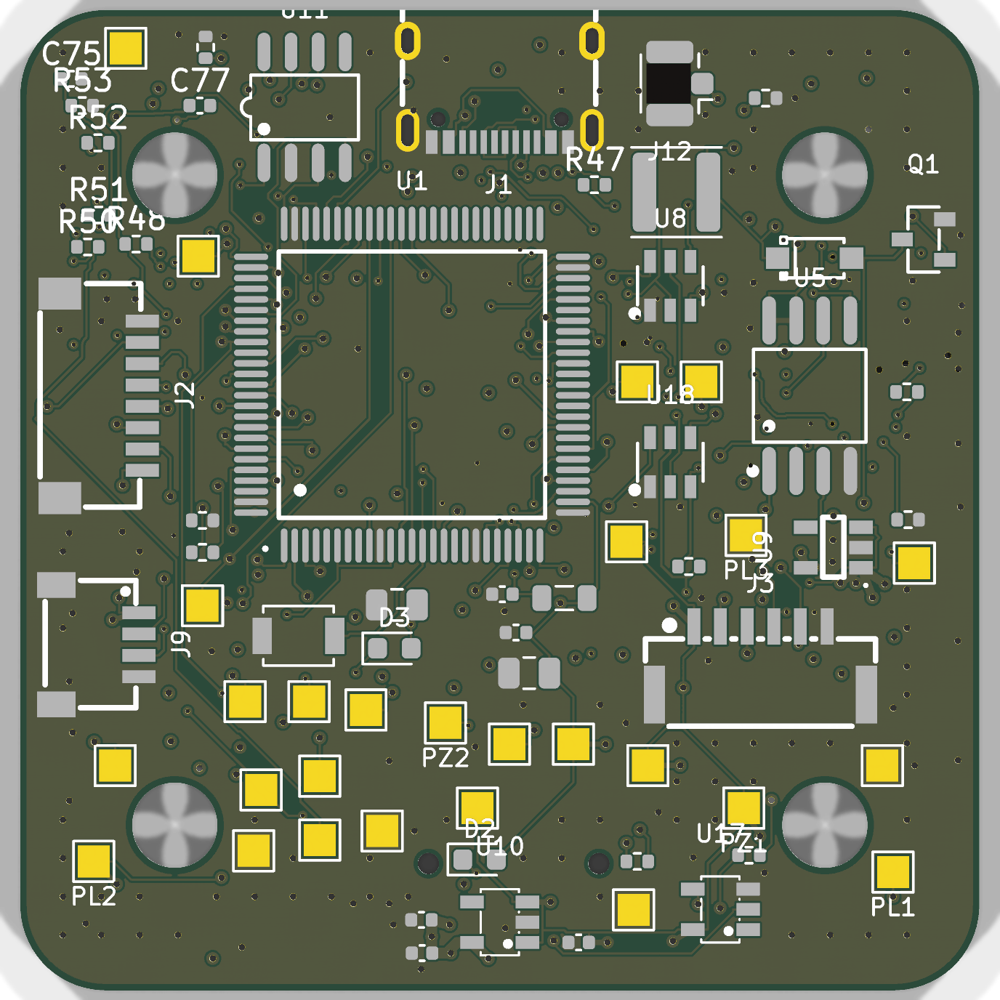
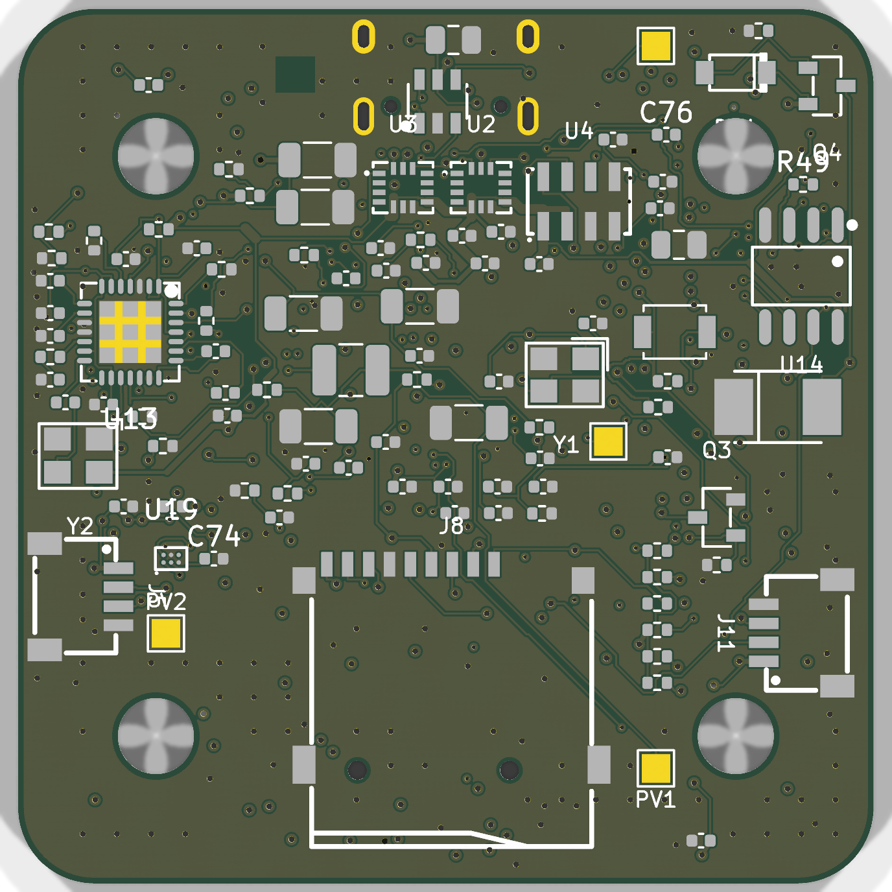
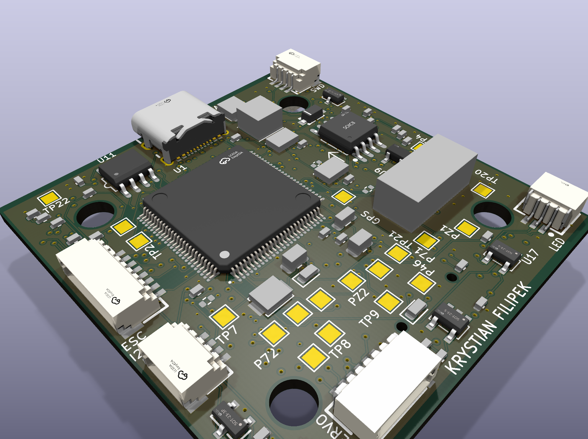

# NAVCORE-SoOP

A 45.1 × 46.1 mm, 6-layer STM32H743 flight controller for testing navigation without GPS.

| top | bottom |
|---|---|
|  |  |

## The idea

Drones stop being autonomous the moment GPS does. The usual answer is cameras and SLAM,
which is accurate frame to frame but drifts further the longer you fly.

This board tests a different approach: working out position from the Doppler shift on
Iridium satellite signals. They cover the whole planet, they transmit continuously, and
they were never intended for navigation. A fix from them is rough, somewhere around
100-200 m in the published literature, but it is absolute, so the error stays bounded
rather than growing over time. That makes it a reasonable complement to the camera
methods, which is the thing I wanted to try.

It fits a normal 30 x 30 mm stack on a 7-inch quad and runs stock ArduPilot, because the
pinout matches the MatekH743 across all 75 assigned pins.



| | |
|---|---|
| MCU | STM32H743VIT6, 480 MHz, LQFP-100 on 0.5 mm pitch |
| IMU | ICM-42688-P and ICM-42605, LGA-14, on their own 3.3 V analogue rail |
| Sensors | MS5611 baro, W25Q128 flash, microSD |
| Power | two synchronous bucks (16.8 V to 5 V, and 16.8 V to 9 V), two 3.3 V LDOs |
| I/O | USB-C, CAN, 8 UARTs, 4 x DShot, addressable LED, SWD |
| SoOP | MAX2112 tuner and OPA2374 baseband amps on board, U.FL antenna input |
| Payload | I/Q, RSSI and PPS also brought out to pads for probing |

Two of those are **designed and provisioned but not fitted as ordered**, and the BOM says
so: `U18` (the 9 V VTX buck — its switch node could not be closed on this placement) and
`U11` (the CAN transceiver — it drew rail for a feature `defaults.parm` never enabled).
Both have pads and paste-free footprints, and `preflight.py` prints `[NOT FITTED]` for
each on every run. Everything else in the table is populated.

Two things that are easy to misread. The downconversion happens on the board and the H743
samples the I/Q itself — but the board flies on its real GPS today, and the SoOP chain
runs in two halves with different statuses: the **receiver is on the board**, while the
**companion is deferred** (`J4` was cut on 2026-09-09, so UART7 has no landing and the
optical-flow camera is deferred with it). The Doppler solve itself is written and
validated offline (`tools/soop_solver.py`): it inverts a known position from clean
geometry, reports singular on degenerate geometry rather than inventing a number, and
measures the geometry's own contribution — 160 m median at 5 Hz of burst-frequency noise
over 40 bursts, which is the precision the receiver has to hit. What is **not** built is
the rest of the pipeline: burst detection and frequency estimation from I/Q, the on-board
C firmware, and the GPS backend that gets a fix into the EKF. As built this is an
ordinary GPS quadcopter with room to expand, since every optional sensor ships disabled.
ArduPilot refuses to arm if something is configured but not physically fitted, so that is
deliberate. The antenna side is bought rather than designed: a SAWbird+ IR does the
low-noise amplification and the 1620 MHz filtering where it belongs, at the antenna, and
coax brings it to a U.FL.

It ended up on six layers because of the H743. Nothing fits between its pads at any design
rule you can actually buy (0.200 mm gap against 0.3048 mm needed), so every pin has to
escape outward to a via. On four layers the inner pins had nowhere to go and the router
stalled around 89%. Six layers took it to 97%.

```
F.Cu    signal      In1.Cu  GND plane     In2.Cu  signal
In3.Cu  signal      In4.Cu  power rails   B.Cu    signal
```

## Status

The board is ready to order but has not been built, so nothing here has been measured on
real hardware.

```
tools/preflight.py   READY TO ORDER - all 44 gated prerequisites proven, 0 order-checks outstanding
                     66 prerequisites: 44 gated, 5 order-time actions, 8 bench-only, 4 advisory, 4 to build*
tools/check_rf.py    NOT READY TO FLY - the bench measurements don't exist yet
```

*the gate also prints **4 items that are code, not measurement** — the four components of the
on-board Iridium DSP (ephemeris, burst detection, H743 firmware, EKF backend). A green gate
says nothing about it, so the verdict prints it. See `docs/KNOWN-ISSUES.md`.

The layout side is finished: no DRC errors, no ERC violations, every connection on a
fitted part routed, gerbers checked against the board file, 131 footprints checked against
JLCPCB's own joint counts, and all 56 order lines confirmed in stock (snapshot
2026-09-19, aged 0 days).

One number is worth knowing before you copy this design: the MAX2112 tuner was down to **15
units at LCSC** in the last stock snapshot (2026-09-19) and nothing else in their library
covers 1616 to 1626.5 MHz with quadrature baseband out. Buy spares. **USB does not power
this board** — `VBUS` reaches only the ESD part and a bypass cap, so `J2.2` needs a pack or
a bench supply even to configure it.

**Ready to order is not ready to fly, and the two are gated separately.** `check_rf.py`
fails until the four RF self-interference measurements in T3b exist. That is expected
before the hardware arrives, and it is deliberately not an order blocker.

## Verification

The design is generated from a single Python file and gated by 66 classified prerequisites (44 of them hard gates), whose
verdict is derived from a manifest rather than restated beside it (`tools/readiness.py`);
anything unproven fails. Most of what I learned came from checks that passed while the
thing they were supposed to catch was still there:

- Both buck regulators were missing their catch diode. All 64 checks passed at the time,
  because each one tested a property of something present, and a missing part has no net
  and no footprint to inspect.
- 82 of 118 parts were 180 degrees out in the pick-and-place file. KiCad flips a footprint
  about its Y axis and the assembler rotates about X.
- A clearance rule reported 114 mm of margin on a ground clearance question. It could never
  have failed, because the skids are out at the motors and the ground isn't a part in the
  model.
- A TVS diode sitting in front of two 30 V regulators clamped at 53 V. It had been chosen
  on cell count, which isn't really the question a TVS answers.
- A reference oscillator wired with its supply pin grounded. It was an active part wired
  to a passive crystal's pattern, so it could never have started, and every connectivity
  check passed because all four pins were connected. Just not to the right things.
- The board and the design file drifted 43 parts apart, in both directions at once, while
  the gate reported five unrelated blockers. The comparison between them only ever looked
  at parts present in both files.
- Two defects only a real firmware build caught: the VL53L1X rangefinder was **held in
  shutdown by its own firmware** (`R13` pulls `TOF_XSHUT` up; the hwdef drove it LOW from
  boot), and **ESC telemetry was wired to a transmit pin** (`UART8_TX`) and could never be
  read.

In each case the check was measuring something adjacent to the property that mattered. The
sharpest version of it is a check that reads a hand-maintained table instead of the thing
itself, which is why adding a part now means asking which lists have quietly become wrong.
I try to break every check on purpose before trusting it, and put it back afterwards.

```bash
python3 tools/preflight.py     # the go/no-go gate; the verdict is derived, not printed
python3 tools/check_rf.py      # ready-to-fly; computes nothing by design
```

The firmware side is verified the same way: `tools/build_firmware.sh` builds real ArduPilot
(bootloader + arducopter) against this board's hwdef — the only test that proves the pin
assignments, DMA allocation and flash layout are actually workable. The last build recorded
**zero DMA conflicts and zero warnings**, and records the sha256 it compiled from so the
gate checks content, not timestamps.

## Ordering

`fab/NAVCORE-SoOP-order-bundle.zip` has the gerbers, BOM and CPL for the build variants,
plus the fab settings. `tools/make_order_bundle.sh` rebuilds it, and refuses to run if the
export doesn't contain six copper layers. The runbook (Part 1) has the exact JLCPCB settings,
and `docs/PARTS.csv` lists everything else the aircraft needs — including what is
deliberately **not** being bought (the companion and flow camera are deferred with a
recorded reason).

At the JLCPCB checkout, five settings matter and are listed by the gate itself: **1 oz
outer copper; accept the free DFM review; leave impedance control OFF; 5 bare / 2
assembled, BOTH sides; panel by JLCPCB, 2 × 2** (the bare board is under JLCPCB's 70 × 70 mm
single-PCB floor for Standard assembly).

## Where everything is

```bash
python3 tools/preflight.py           # one command re-proves everything below
export JLC_LIB=/path/to/jlc.pretty   # only needed for 3D STEP exports, not for checks
```

| path | what it is |
|---|---|
| `tools/design.py` | single source of truth: board, airframe, buying list |
| `tools/preflight.py` + `tools/readiness.py` | the gate, and the manifest its verdict is derived from |
| `firmware/NAVCORE_SoOP/` | ArduPilot hwdef and shipped defaults |
| `sitl/` | SITL harness for the GNSS-denied scenarios |
| `cad/` | OpenSCAD airframe model, generated from `design.py` |
| `libraries/` | vendored symbols and footprints — a fresh clone resolves everything, no path variable |
| `docs/navcore-runbook.tex` / `.pdf` | the order-to-first-flight runbook |
| `docs/PARTS.csv` | the procurement decision record the order sheet is generated from |

The remaining work in one place: **run the gate** — it prints order-time actions, bench
items, and what is not built yet. `docs/KNOWN-ISSUES.md` is the register behind it.

## Documentation map

**The runbook is the one document to follow**: `docs/navcore-runbook.pdf` (source
`.tex`, tracked) covers ordering, buying, assembly, T0–T5 bring-up and first flight, and its
figures are checked by `tools/check_doc_figures.py` against the values the project has
retired. The separate ORDER / ASSEMBLY / BUILD drafts were folded into it on 2026-09-19.

The remaining `docs/*.md` are held-back drafts — on disk, read by the tooling, not yet
published. What each one answers:

| question | document |
|---|---|
| Order → assemble → power up → fly, in order | **`docs/navcore-runbook.pdf`** |
| What do I buy, from where, and what must I check first? | **`docs/PARTS.csv`** (the decision record) → **`docs/BUYING.md`** (generated order sheet) |
| Will it physically fit? What are the dimensions? | **`docs/HARDWARE.md`** — frame, stack and fastener tables |
| What can I hang off it, and how accurate is the navigation? | **`docs/SENSORS.md`** — payload provisions, the GNSS-denied chain, the accuracy ceiling |
| Can I add FPV / optical flow / the RF front end later? | **`docs/MODULES.md`** — one board, and everything that bolts onto it |
| How does this compare to a Pixhawk, or to open-source GPS-denied projects? | **`docs/BENCHMARK.md`** — FMUv6X, the SLAM/VIO field, and the SoOP literature |
| What is actually proven, and what is not? | **`docs/VERIFICATION.md`** |
| Which pin does what? | **`docs/PINMAP.md`** |
| What is still open, and why? | **`docs/KNOWN-ISSUES.md`** — the register |
| Board state, design rules, remaining connections | **`docs/LAYOUT.md`** / **`docs/ROUTING-TODO.md`** (generated) |
| Which tool does what, and which are history | **`tools/README.md`** |

Symbols and footprints are vendored under `libraries/` (`sym-lib-table` and `fp-lib-table`
committed and pointing at them), so a fresh clone resolves everything with no path
variable. Only the 3D STEP bodies are not vendored (~56 MB, read by `export_3d.sh`, and by
no correctness check) — set `JLC_LIB` to the fetch directory containing `packages3d/` if
you want a populated 3D export. See `libraries/README.md` for what is versioned and why.
