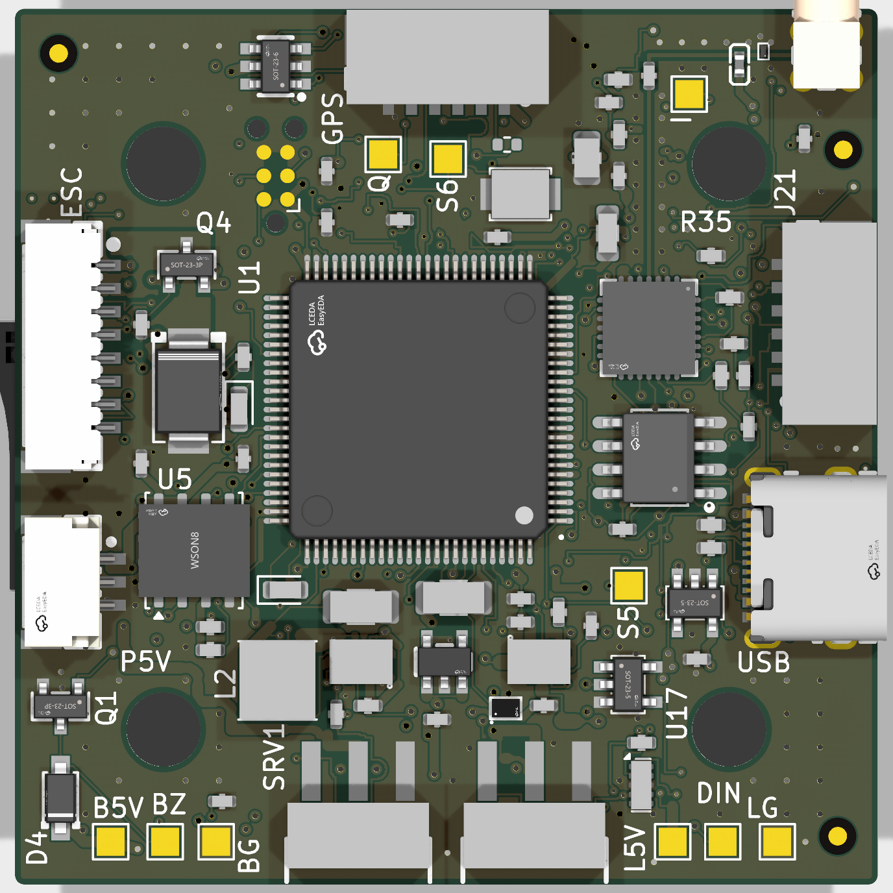
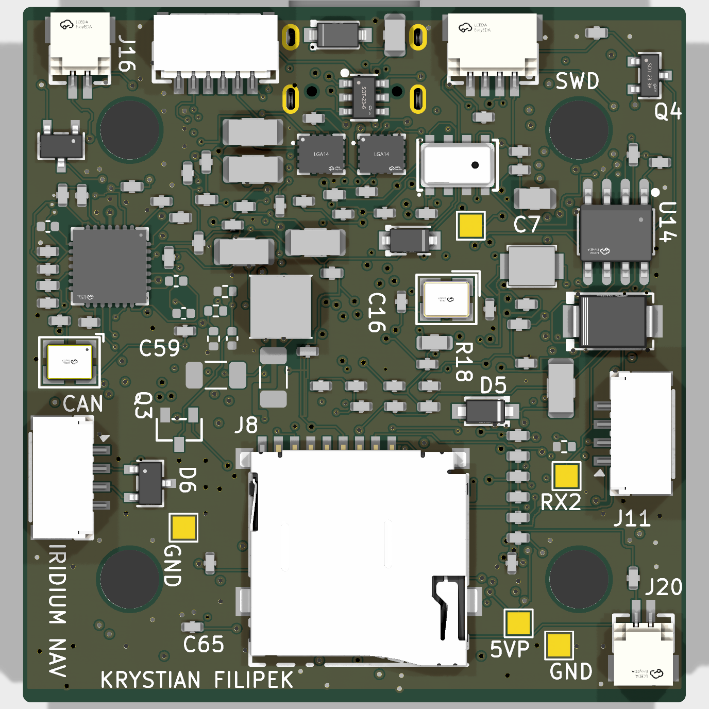
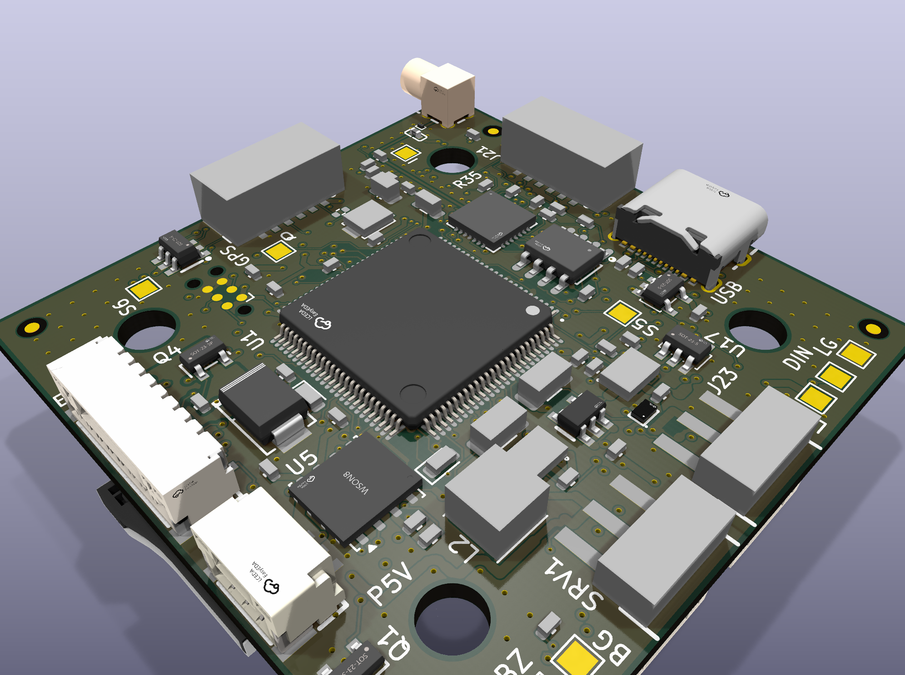

# NAVCORE-SoOP

A 46.5 × 47.2 mm, 6-layer STM32H743 flight controller designed for navigation in GPS-denied environments via satellite signals of opportunity (SoOP), with native support for standard ArduPilot multirotors and TVC rocket lander avionics.

| Top View | Bottom View |
|:---:|:---:|
|  |  |

---

## Overview

Autonomous UAVs lose navigation when GPS is degraded or jammed. Optical flow and visual-inertial odometry provide relative velocity and short-term positioning, but accumulate unbounded integration drift over long trajectories.

**NAVCORE-SoOP** investigates an absolute, drift-bounded alternative: positioning from the Doppler shift of **Iridium NEXT** low-Earth-orbit communication satellites. Because Iridium satellites orbit in polar LEO (~780 km altitude) at ~7.5 km/s and broadcast continuously across 1616–1626.5 MHz, multi-satellite Doppler observations yield absolute position constraints with bounded error (typically 100–200 m), providing a drift-free reference that complements high-rate visual/inertial sensors.

The board fits a standard 30.5 × 30.5 mm mounting pattern, runs ArduPilot (`NAVCORE_SoOP` target, MatekH743-compatible pinout), and integrates:
- On-board L-band direct-conversion receiver (MAX2112 tuner + OPA2374 baseband filter), with a current-limited, monitored +5 V feed for the active antenna on its MMCX port
- Dual industrial IMUs on an isolated low-noise analog power rail
- 3S–5S LiPo power distribution with dual synchronous buck converters
- Expansion for other airframes: two servo outputs on the payload rail, a 5 V payload port, a companion-computer port and DroneCAN



---

## Hardware Specifications

| Subsystem | Components & Specification |
|:---|:---|
| **MCU** | STM32H743VIT6 (ARM Cortex-M7 @ 480 MHz, 2 MB Flash, 1 MB RAM, LQFP-100) |
| **IMU** | Dual independent IMUs: TDK InvenSense ICM-42688-P (SPI1) + ICM-42605 (SPI4) on filtered 3.3 V analog LDO |
| **Barometer** | TE Connectivity MS5611-01BA03 (I2C2, on the 3.3 V analogue rail) |
| **Flash & Storage** | Winbond W25Q128 128 Mb SPI Flash (SPI3, WSON-8; holds the Iridium orbit catalogue) + MicroSD card socket (SDIO 4-bit) |
| **RF / SoOP Front-End** | Maxim Integrated MAX2112 direct-conversion L-band tuner (1616–1626.5 MHz, I2C2) + TI OPA2374 dual baseband filter/amplifiers into ADC1/ADC2 quadrature inputs; MMCX 50 Ω RF port (`J12`) carrying +5 V to the antenna's LNA from `U24` (AP22653 load switch, 95–155 mA limit) through a 2.2 Ω sense resistor read by `U25` (INA180A2) on ADC3, so the firmware reports the antenna as open, ok or short |
| **Power Architecture** | 3S–5S LiPo input (up to 21.0 V), SMBJ22A TVS clamping at 35.5 V under the bucks' 38 V absolute maximum; reverse-polarity P-FET<br>• Buck 1 (U8, system +5V): TI LMR33630 VQFN, 1.6 A continuous (set by the 4 × 4 mm inductor, not the 3 A IC)<br>• Buck 2 (U20, +5V_PAYLOAD for servos, CAN, LED, camera/VTX): LMR33630, 2.1 A continuous (set by its 5 × 5 mm inductor), budgeted per mission<br>• LDO 1: 3.3 V system (TLV75733P, exposed-pad SOT-23-5 into the ground plane)<br>• LDO 2: 3.3 V clean analogue for IMUs, baro and tuner (TLV75533)<br>• LDO 3: 3.3 V DroneCAN (XC6206) |
| **Interconnects** | Latching JST-GH 1.25 mm on every cable port: GPS 6P, companion 6P (UART7, Pixhawk TELEM order), optical flow 6P, RC 4P, I2C 4P, DroneCAN 4P, lidar 4P, ESC 8P and payload 5 V 3P (both side entry). Two 1×3 2.54 mm servo headers (SMD right angle), MMCX antenna, USB-C, microSD, Tag-Connect TC2030 SWD pads, and soldered pads for the LED strip and buzzer. ESD clamps at the GPS, RC and CAN connectors |
| **PCB Stackup** | 6-layer, no impedance control ordered (46.5 × 47.2 mm outline, 0.5 mm corner radius, 1 oz outer / 0.5 oz inner copper) |

---

## Layer Stackup

The 0.5 mm pitch LQFP-100 pin escape requires outward via routing across internal signal layers:

```
Layer 1 (F.Cu):    High-speed RF, crystal signals, MCU escape fanout
Layer 2 (In1.Cu):  Continuous uninterrupted ground reference plane (GND)
Layer 3 (In2.Cu):  High-speed digital buses (SPI1..4, SDIO, I2C)
Layer 4 (In3.Cu):  Low-speed I/O, UARTs, timer PWM signals
Layer 5 (In4.Cu):  Power distribution planes (+5V, +5V_PAYLOAD, +3V3, VBAT)
Layer 6 (B.Cu):    Sensors, RF receiver circuitry, DroneCAN, buck converters
```

---

## Supported Platforms

### 1. GNSS-Denied Drone Platform
- Standard 30.5 × 30.5 mm flight stack mounting on 7-inch / 10-inch quadrotor frames
- DShot300/600 motor outputs via `J2` (JST-GH 8P, side entry, in SpeedyBee's pin order; the ESC end is JST-SH 8P, so the lead is GH 8P to SH 8P, straight-through)
- SPI3 optical flow connector (`J14`, JST-GH 6P, for a PMW3901-class module)
- Companion port `J21` (UART7 = SERIAL1, JST-GH 6P, Pixhawk TELEM order with CTS/RTS; pin 1 powers a radio-class load only)
- Serial port `J11` (USART1 = SERIAL2, JST-GH 4P: +5V_PAYLOAD / TX / RX / GND) for the LD06 lidar
- Payload 5 V port `J22` (JST-GH 3P) for a camera or VTX
- Dedicated DroneCAN transceiver (`J6`, JST-GH 4P)

### 2. TVC Rocket Lander Platform (`lander-2`)
- Two thrust-vector control servo outputs, `J17` (PWM7) and `J23` (PWM8): 1×3 2.54 mm male headers in the standard servo order (1 signal, 2 +5V_PAYLOAD, 3 GND), so a servo plugs straight in; powered by the independent payload buck
- High-rate 6-DoF inertial logging to MicroSD via SDIO

---

## Repository Structure

```
├── NAVCORE-SoOP.kicad_pcb   # 6-layer KiCad PCB artwork
├── NAVCORE-SoOP.kicad_sch   # Schematic (generated from tools/design.py)
├── fab/                     # JLCPCB manufacturing bundle (Gerbers, drill, BOM, CPL, stock snapshot)
├── firmware/NAVCORE_SoOP/   # ArduPilot hardware definition (hwdef.dat, defaults.parm)
├── tools/                   # Automated validation suite (DRC, ERC, placement, clearance gates)
├── cad/                     # OpenSCAD airframe integration & mechanical clearance models
├── libraries/               # Vendored footprint (.pretty) and symbol (.kicad_sym) libraries
└── docs/                    # Technical reference documentation and assembly guides
```

---

## Verification & Build Gate

All design files are verified via an automated verification pipeline:

```bash
# Run the complete automated readiness gate
python3 the board checks

# Verify KiCad DRC & ERC
kicad-cli pcb drc --severity-error NAVCORE-SoOP.kicad_pcb
kicad-cli sch erc NAVCORE-SoOP.kicad_sch

# Verify mechanical connector orientation and mating clearances
python3 tools/check_connectors.py

# Check component stock availability at JLCPCB / LCSC
python3 tools/check_stock.py
```

---

## Fabrication & Ordering

Pre-packaged manufacturing files ready for ordering at JLCPCB are in `fab/`:
- **Gerbers & Drill**: `fab/NAVCORE-SoOP-order-bundle.zip`
- **Bill of Materials**: `fab/BOM-NAVCORE-SoOP.csv`
- **Pick-and-Place (CPL)**: `fab/CPL-NAVCORE-SoOP.csv` (rotations pre-aligned for JLCPCB SMT feeders)
- **Schematic PDF**: `fab/NAVCORE-SoOP-schematic.pdf`

Recommended JLCPCB ordering parameters:
- **Layers**: 6 Layers
- **Dimensions**: 46.5 × 47.2 mm (Panel by JLCPCB, 2 × 2 recommended for SMT)
- **Base Material**: FR-4 (TG155)
- **Outer copper**: 1 oz (every current rating assumes it)
- **Impedance control**: none
- **Via covering**: Epoxy Filled & Capped (some vias sit inside SMD pads)
- **Surface Finish**: ENIG (Electroless Nickel Immersion Gold recommended for LGA-14 IMUs)
- **Mark on PCB**: Remove Mark
- **Assembly**: Top + Bottom SMT
